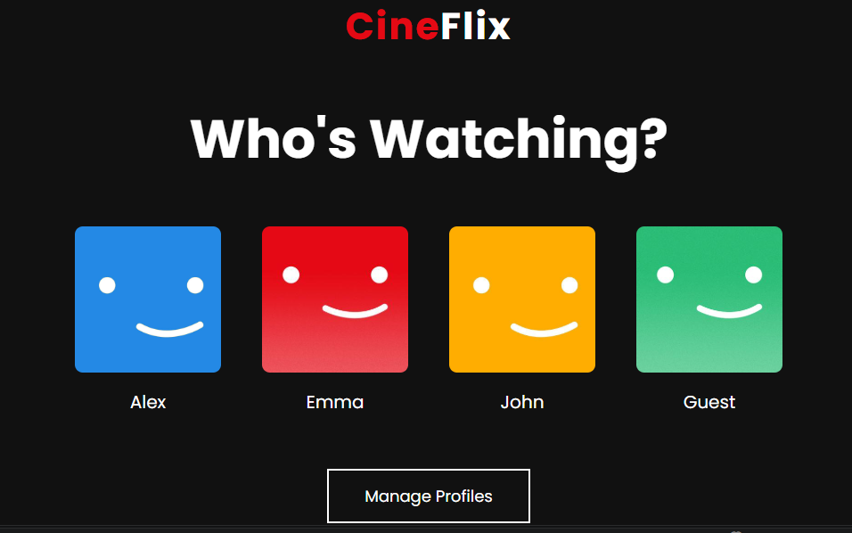
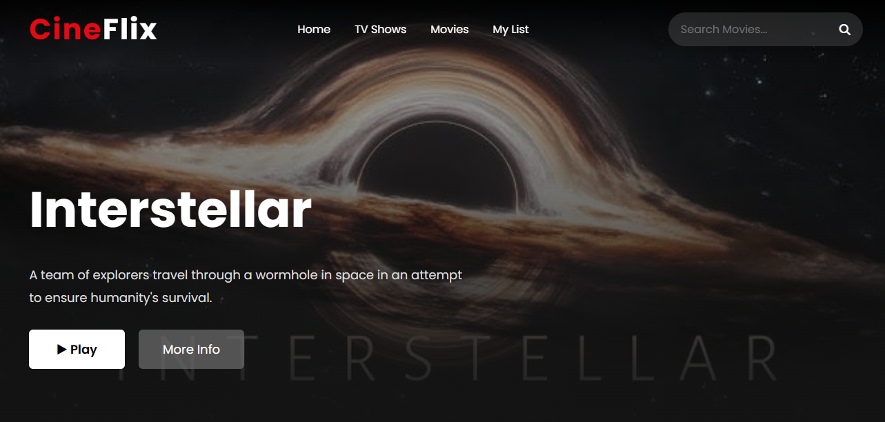
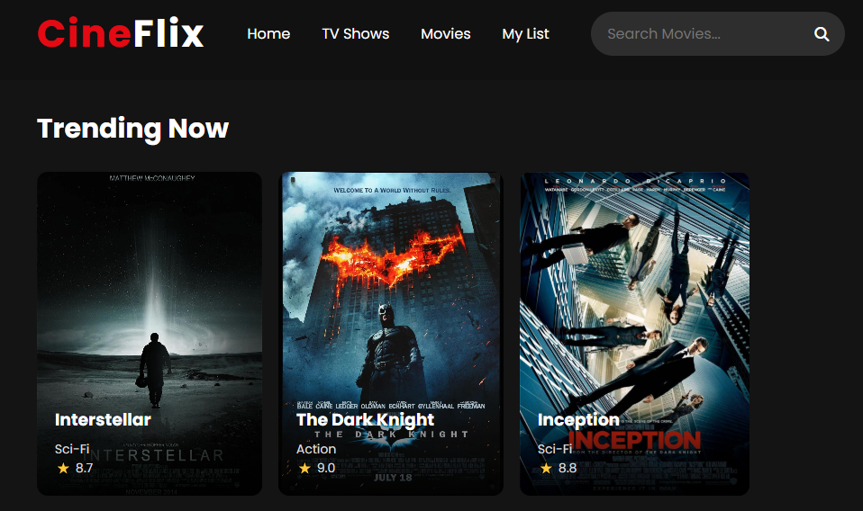

# 🎬 CineFlix - Netflix Inspired Streaming UI

A Netflix-inspired movie streaming interface built with **HTML, CSS, and JavaScript** featuring a modern UI, responsive design, and smooth user interactions.

---

## ✨ Features

- 👤 Profile Selection
- 🎬 Hero Banner
- 🔍 Movie Search
- 🎞️ Multiple Movie Categories
- 📱 Responsive Design
- 🌙 Dark Theme
- ✨ Smooth Hover Animations

---

## 🛠️ Tech Stack

- HTML5
- CSS3
- JavaScript

---

## 📸 Screenshots

### Home Page


### Profile Selection


### Movie Categories


---

## 🚀 Future Improvements

- TMDB API Integration
- Movie Details Modal
- My List (Favorites)
- Trailer Popup
- User Authentication

---

## 📂 Project Structure

```
CineFlix/
│── index.html
│── style.css
│── script.js
│── images/
│── screenshots/
│   ├── home.png
│   ├── profile.png
│   ├── trending.png
│   ├── top rated.png
└── README.md
```

---

## 📜 License

This project is created for educational and portfolio purposes.
